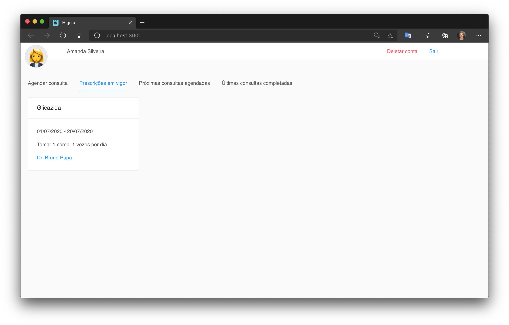
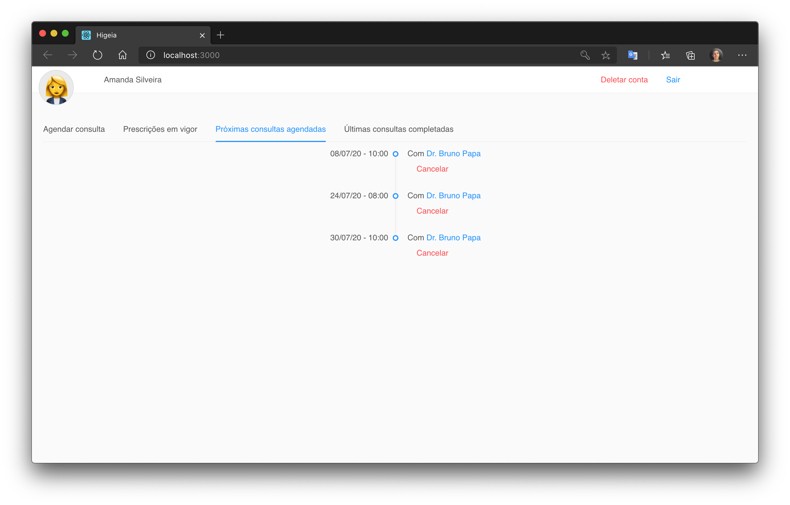
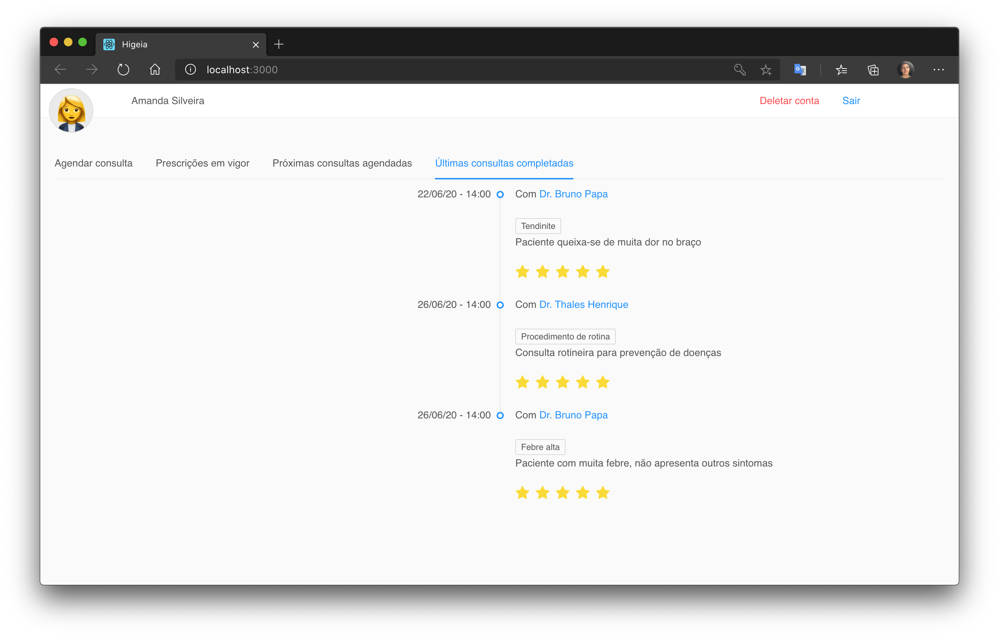
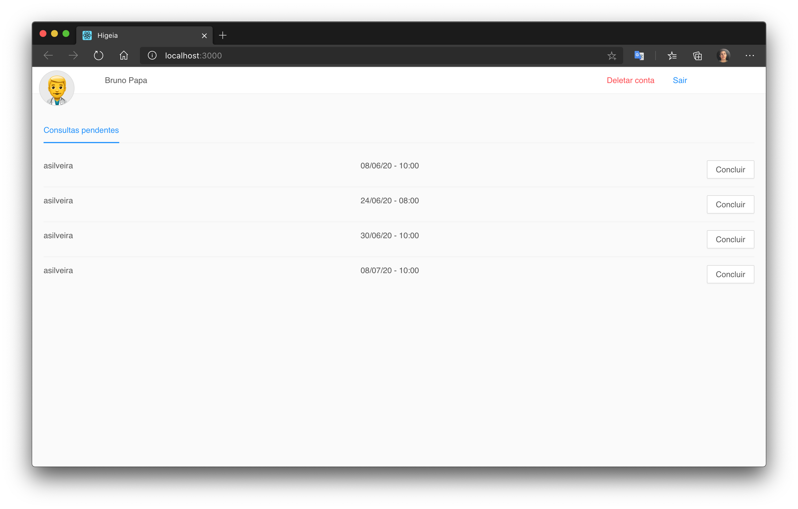
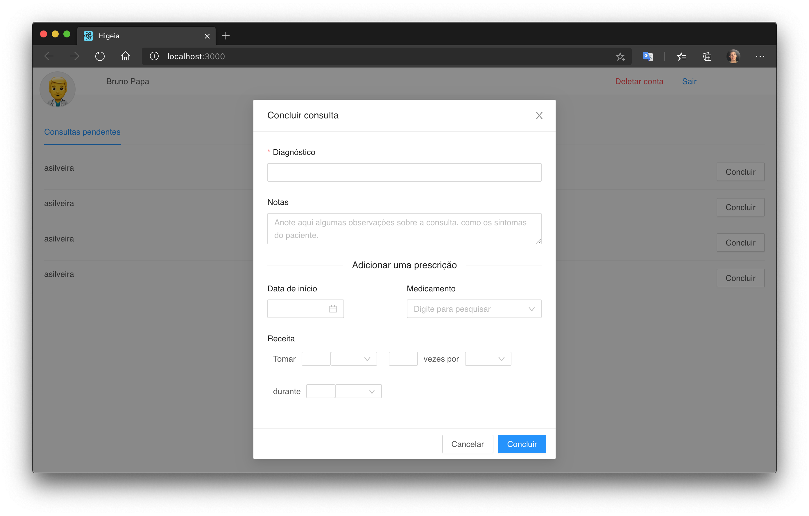
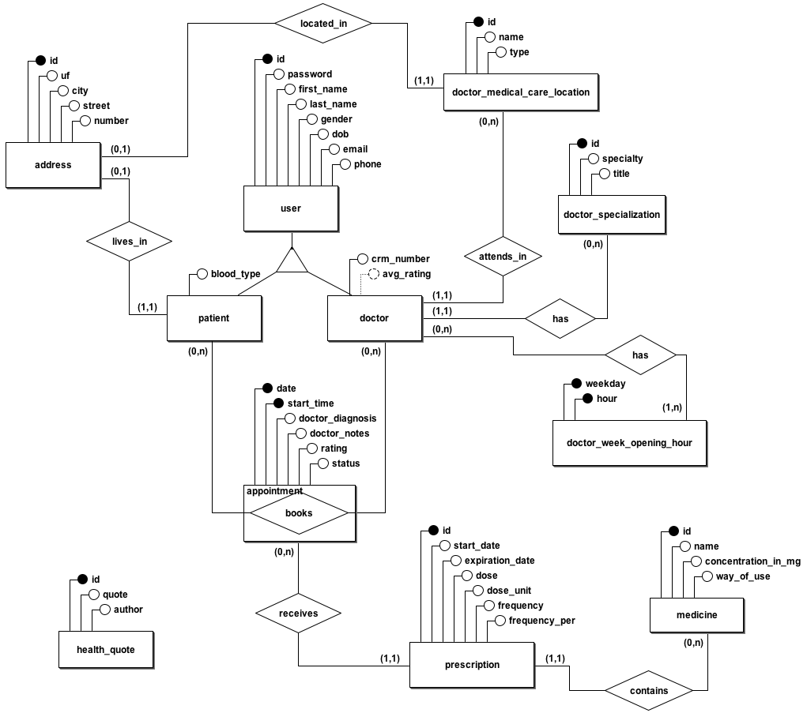

<h1 align="center">Higeia</h1>
This project was my final work for the discipline "4720A - Data Base I", in july 2020.

# Table of contents

- [Overview](#overview)
  - [UI screenshots](#ui-screenshots)
  - [Entity Relationship Diagram (ERD)](#entity-relationship-diagram-erd)
- [Implemented use cases](#implemented-use-cases)
  - [Unlogged user](#unlogged-user)
  - [Logged user](#logged-user)
  - [Logged patient user](#logged-patient-user)
  - [Logged doctor user](#logged-doctor-user)
- [Installation](#installation)
  - [Database](#database)
  - [API server](#api-server)
  - [Web client](#web-client)

# Overview

## UI screenshots








## Entity Relationship Diagram (ERD)



# Implemented use cases

## Unlogged user

- [x] Login

- [ ] Register

- [ ] Health quote of the day

## Logged user

- [ ] Profile settings

  - [x] Log out

  - [x] Delete account

  - [ ] Edit account

## Logged patient user

- [ ] **Find doctors to book appointments**

  - [ ] View a list of all doctors registered in the system.

  - [x] For each doctor, it is possible to book an appointment at a valid date and time.

  - [ ] It should be possible to filter the list by doctor specialization.

  - [ ] For each doctor, you can see more details about him by visiting his public page.

- [x] **Next appointments**

  - [x] View a list of your next appointments, that is, those with "scheduled" status and with a start date later than the current one.

  - [x] The list order must prioritize the most recent appointment.

  - [x] For each appointment, you can cancel it.

- [x] **Last appointments**

  - [x] View a list of your last appointments that have already happened, that is, those with "completed" status and start date earlier than current one.

  - [x] The list order must prioritize the most recent appointment.

  - [x] For each appointment, you can evaluate it.

- [x] **Active prescriptions**

  - [x] View a list of your medical prescriptions that are still in effect, that is, only those with expiration date later than or equal to the current date.

  - [x] For each prescription, you can view the medicine name, the start and expiration date, the details (dose and frequency) and the doctor who prescribed it.

- [ ] **View details of a completed appointment**

## Logged doctor user

- [x] **Pending appointments**

  - [x] View a list of your pending appointments, that is, those with date earlier than the current one but that are still with "scheduled" status.

  - [x] For each appointment, you can add a diagnosis, a note and a prescription. When you do this, it becomes "completed" and therefore leaves the list of pending appointments.

- [ ] **Next appointments**

  - [ ] View a list of your next appointments, that is, those with date later than the current one.

- [ ] **Last activities**

  - [ ] View a lof of your last activities on the system.


# Installation

For run this project locally, you need have installed on your SO:

- [Yarn](https://classic.yarnpkg.com/en/docs/install) at least 1.22
- [MySQL](https://dev.mysql.com/doc/refman/8.0/en/installing.html) at least 8.0
- [Node.js](https://nodejs.org/en/download/) at least 14.0

## Database

<!-- mysql --user=root --password=123456789 --database=higeia -->

After setup and connect to your local database:

  - Run the script `create.sql` to create the tables and triggers of the database.

  - Run the script `populate.sql` to fake populate the database.

## API server

Inside `packages/api`, you must create a `.env` file based on the `.env.example` to set your own configs related to your local database, and run:

```bash
# To install all dependencies listed on the `package.json` file.
> yarn install

# To run the server.
> yarn start
```

## Web client

Inside `packages/web`, you must alter the file `src/services/api.ts` with the port you set above, and run:

```bash
# To install all dependencies listed on the `package.json` file.
> yarn install

# To run the app on http://localhost:3000.
> yarn start

# To build the bundled app for production on the `build` folder.
> yarn build
```
